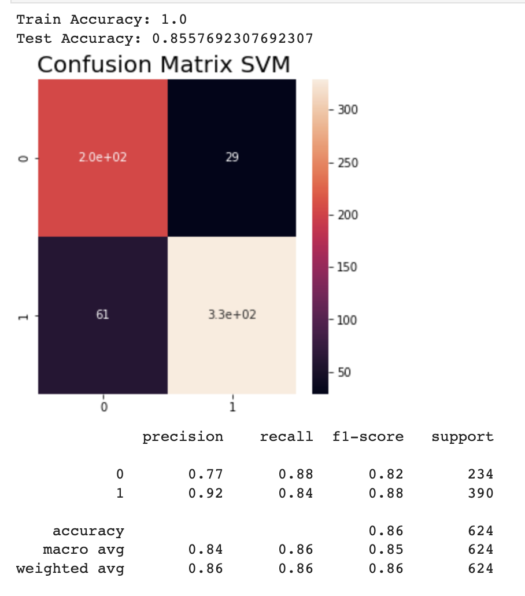
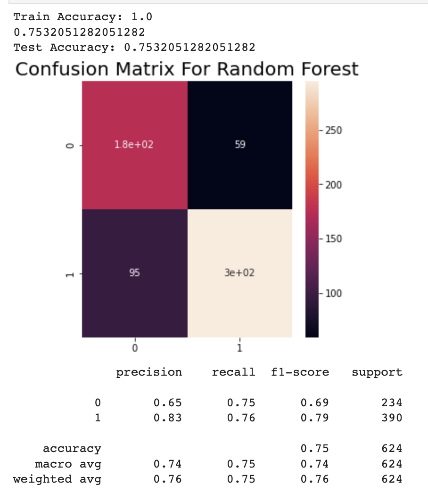
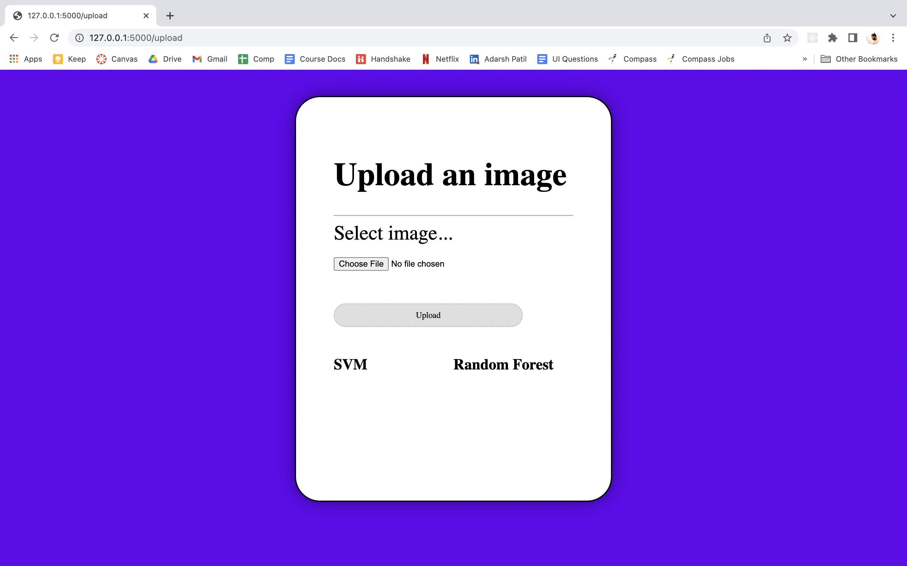

# Pneumonia Detection using Machine Learning
## Team Members
- Rugved Manookar 015017457
- Anjali Jain     015244151
- Adarsh Patil    014749228

## Introduction
Pneumonia can range from a mild to serious or life-threatening infection and can sometimes lead to death. It is detected using X-ray imaging.It is commonly misclassified as other diseases since radiographs are not particularly clear. Machine learning models can be used to identify pneumonia in chest X-rays.
## Models
1. SVM
2. Random Forest
## Dataset and Preprocessing
Dataset : https://www.kaggle.com/datasets/paultimothymooney/chest-xray-pneumonia

We start with 2000 samples from the Mendeley dataset.
1000 positive samples (x-rays labeled pneumonia)
1000 negative samples (x-rays labelled as not pneumonia)

These samples are high quality JPEG images. We use python OpenCV library to resize these images and then convert to grayscale inorder to reduce the complexity. All the pneumonia positive samples are labelled as 1 and negative samples are labelled as 0. 

## Feature Extraction
After preprocessing the dataset, we extract 10 features from all the images to form a feature vector for each sample: variance, standard deviation, skew, kurtosis, entropy, canny edges, local binary pattern (LBP), Sobel X, and Sobel Y. We use NumPy, OpenCV, and skimage.feature packages to extract these features from images. 

## Feature Scaling
Feature Scaling is a technique of bringing down the values of all the independent features of our dataset on the same scale. We use StandardScaler from sklearn.preprocessing library to scale our feature vectors.

## Training and cross-validation
We are running both the model SVM and Random Forest for training the model on feature vector of training dataset. We are using K-Fold where K=5 cross validation to ensure there is no overfitting.

## Testing 
Post training the model, we fit our trained model on test dataset.Using sklearn.metrics we calculated precision, recall, f1 score and accuracy score.

## Comparision between SVM and Random Forest Model
1 - pneumonia
0 - Normal

###  Confusion Matrix for SVM Model

###  Confusion Matrix for Random Forest Model

## Integration with Flask App
Flask application is created as a front end to upload images of format PNG, JPEG, GIF to predict whether the model can predict if the image shows the sign of pneumonia or not. 
POST API created of route - /upload to upload images 
GET API created to display - / display/{image_name} uploaded images
## UI Screenshots

